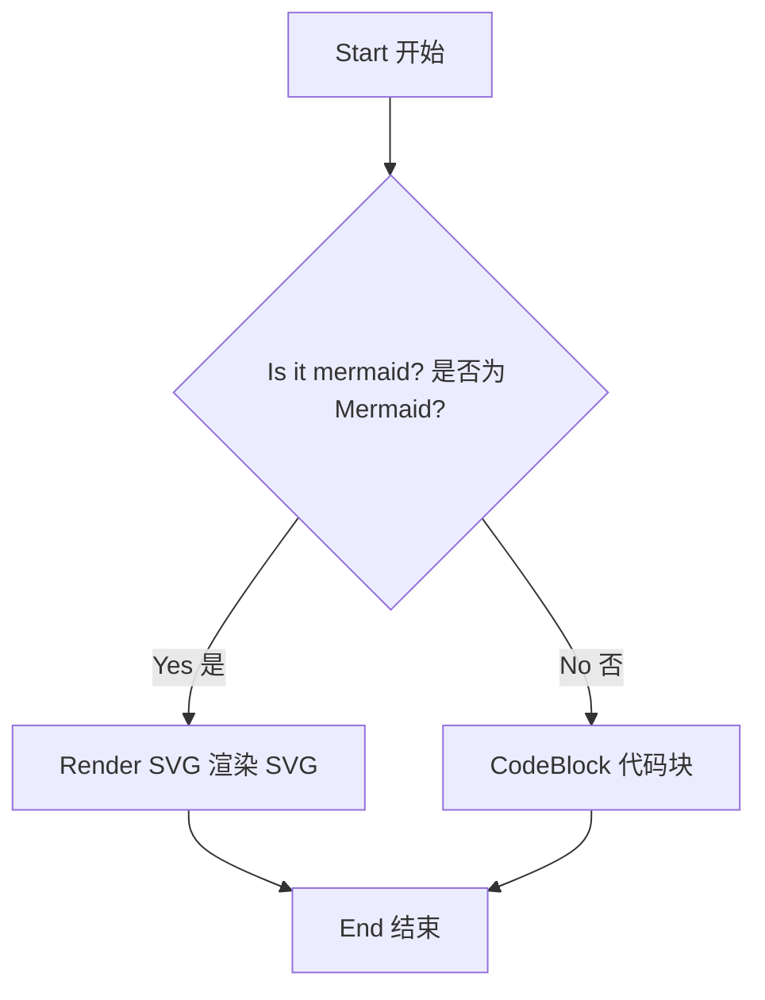
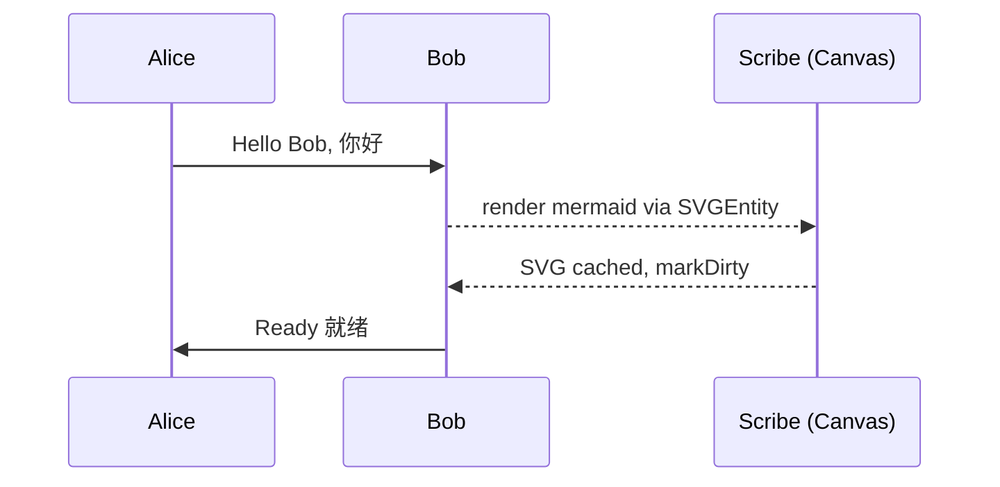
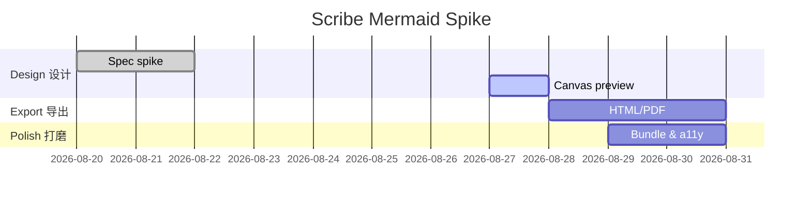

# Scribe — Markdown Kitchen Sink

Hello Scribe — welcome to the kitchen sink. This sample demonstrates VectoJS Markdown completeness. 你好 Scribe — 欢迎来到 Markdown 综合演示，展示 VectoJS 对现代 Markdown 的完整支持（Typora / StackEdit / Obsidian 风格）。

> **Scribe** is a StackEdit-inspired, hybrid HTML + VectoJS canvas editor.
> This document exercises **every** syntax that `@vectojs/markdown` supports.
> If it renders cleanly here, it renders everywhere.
> 中文提示：**Scribe** 是一个类 StackEdit 的混合编辑器，外层是 HTML，核心是 VectoJS Canvas，支持所见即所得与源码分屏。

---

## 1. Headings — 标题 h1-h6

# Heading 1 — The largest

## Heading 2 — Section

### Heading 3 — Subsection

#### Heading 4 — Detail

##### Heading 5 — Fine print

###### Heading 6 — Smallest

# 标题一 — 中文最大标题

## 标题二 — 章节

### 标题三 — 子章节

#### 标题四 — 细节

##### 标题五 — 小字

###### 标题六 — 最小

---

## 2. Inline text decorations — 行内装饰 bold / italic / strike / mark / ins / sub / sup

**Bold** with `**bold**`, _italic_ with `*italic*` or `_italic_`, _**bold + italic**_.

~~Strikethrough~~ with `~~text~~`, ++Inserted++ with `++inserted++`, ==Marked== with `==marked==`.

Superscript: 19^th^, x^2^ + y^2^ = z^2^. Subscript via del trick: H~~2~~O (rendered as `H<sub>2</sub>O` when subscript extension is enabled; fallback is ~~del~~). Sub: H~2~O, CO~2~, x~i~; Sup: E=mc^2^, a^n^.

**加粗** 用 `**加粗**`，_斜体_ 用 `*斜体*`，_**加粗斜体**_ 组合。

~~删除线~~ 用 `~~删除线~~`，++下划线/插入++ 用 `++插入++`，==高亮== 用 `==高亮==`。

上标：10^th^ 十周年，m^2^ 平方米；下标：H~2~O 水，CH~4~ 甲烷。请对比 **加粗带 ~~删除~~ 内部** 与 _斜体带 `代码` 与 $数学$ _。

Inline code: `const x = 42`, `Array<T>`, `` `backtick inside` ``, `中文代码` 与 `console.log("你好")`.

Abbreviation: The HTML specification relies on CSS.

*[HTML]: HyperText Markup Language
*[CSS]: Cascading Style Sheets

Emoji shortcodes: :smile: :rocket: :tada: :fire: :heart: :zap: :books: (requires `:smile:` pass). 中文段落也可以带表情 :tada: 庆祝 :rocket: 起飞。

---

## 3. Links and autolinks — 链接与自动链接

- Inline link: [VectoJS](https://vectojs.org) — 官网
- Inline link 中文: [VectoJS 中文站](https://vectojs.org) 演示中文链接文本
- Autolink: <https://vectojs.org> and <hello@vectojs.org>
- Reference link: [StackEdit reference][stackedit] 和 [Obsidian][obsidian] [Typora][typora]

[stackedit]: https://stackedit.io
[obsidian]: https://obsidian.md
[typora]: https://typora.io

Image (remote, served via R2 `cdn-vectojs`):


Inline image paragraph: text before  text after — should wrap, not break.

中文图片段落：文字之前  文字之后 — 应当环绕而非换行断裂。

---

## 4. Blockquotes — 引用

> Simple blockquote — a single paragraph.
>
> > Nested blockquote — second level.
> > Still inside nested.
>
> Back to first level.

> Blockquote with **bold** and `code` and a list inside:
>
> - item one
> - item two

> 中文引用 — 单段落引用，测试中文字体与行高。
>
> > 嵌套引用 — 第二层，演示中文嵌套。
> > 仍在嵌套内，包含 **加粗** 与 `代码`。
>
> 回到第一层，包含数学 $a^2 + b^2 = c^2$。

> 引用内含列表与代码：
>
> - 中文列表一
> - 中文列表二，带 _斜体_ 与 $E=mc^2$

---

## 5. Lists — 列表 ul / ol / task

### 5.1 Unordered — 无序

- Apple 苹果
- Banana 香蕉
  - Cherry (nested) 樱桃（嵌套）
  - Date 枣
- Elderberry 接骨木

- 中文无序列表示例
  - 子项一：支持 **加粗** 与 `代码`
  - 子项二：支持 $数学$ 与 :smile: 表情

### 5.2 Ordered — 有序

1. First item 第一项
2. Second item 第二项
3. Third item 第三项
   1. Nested ordered 嵌套有序一
   2. Another nested 嵌套有序二
4. Fourth item 第四项

1. 中文有序一
2. 中文有序二
3. 中文有序三

### 5.3 Task lists (GFM) — 任务列表

- [x] Write kitchen sink 编写综合示例
- [x] Add math examples 添加数学示例
- [x] Add Chinese showcase 添加中文展示
- [ ] Ship to `scribe.vectojs.org` 发布到线上
- [ ] Fix TODO in `TODO.md` 修复待办
- [ ] 中文任务：校对翻译

### 5.4 Loose vs tight — 松散与紧凑

Tight list:

- a
- b
- c

Loose list:

- paragraph one 第一段

  second paragraph of same item 同一项的第二段，含中文。

- paragraph two 第二段

中文松散列表：

- 第一段落

  同一项的第二段，测试段间距。

- 第二项

---

## 6. Code — 代码 inline & fenced js / py / bash

Inline `code` already shown. Fenced blocks with language tags (highlighted via `syntaxKeywordColor` etc.): 前文已展示行内代码 `const x = 42`，中文行内代码 `let 你好 = "世界"`。

```js
// JavaScript — keyword / string / comment / number highlights
import { Scene } from "@vectojs/core";
import { Markdown, PRESET_THEMES } from "@vectojs/markdown";

const md = new Markdown("# Hello\n\nWorld", {
  maxWidth: 640,
  theme: "githubLight",
});
scene.add(md);
// comment: numbers 42, 3.14, 0xFF
const answer = 42;

// 中文注释：创建 Markdown 实例并挂载到场景
function greet(name) {
  return `你好, ${name}!`;
}
console.log(greet("Scribe"));
```

```python
# Python — def / string / comment
def greet(name: str) -> str:
    """Return a greeting. 返回问候语"""
    return f"Hello, {name}!  # {42} 你好"

print(greet("Scribe"))
print(greet("世界"))

# 中文注释：斐波那契
def fib(n: int) -> int:
    a, b = 0, 1
    for _ in range(n):
        a, b = b, a + b
    return a
```

```bash
# Bash — 构建与启动
echo "scaffold family + hybrid shell 构建混合外壳"
bun install && bun run dev
# 中文注释：安装依赖并启动开发服务器
echo "你好 Scribe"
ls -la src/assets/sample.md && wc -l public/sample.md
```

```ts
// TypeScript with generics + decorators — 类型与泛型
type Foo<T extends string> = { key: T; value: number };
type Bar = Foo<"中文键">;
// Decorator example
function sealed(constructor: Function) {
  Object.seal(constructor);
  Object.seal(constructor.prototype);
}
@sealed
class Example {
  中文属性: string = "你好";
}
```

```plaintext
Plaintext block — no highlighting, just mono + block affordances.
纯文本块 — 无高亮，仅等宽与块级样式。
```

---

## 7. Tables (GFM) — 表格 aligned 对齐

| Left                    |      Center       | Right | Code | Math     | 中文 |
| :---------------------- | :---------------: | ----: | :--- | :------- | :--- |
| a                       |         b         |     c | `x`  | $a^2$    | 你好 |
| long cell with **bold** | centered _italic_ |    42 | `42` | $E=mc^2$ | 世界 |
| foo                     |        bar        |   baz | `hi` | $\sum$   | 表格 |

Second table — alignment and inline decorations:

| Feature | Syntax        | Rendered                    | 中文示例          |
| ------- | ------------- | --------------------------- | ----------------- |
| Bold    | `**bold**`    | **bold**                    | **加粗**          |
| Italic  | `*italic*`    | _italic_                    | _斜体_            |
| Strike  | `~~strike~~`  | ~~strike~~                  | ~~删除~~          |
| Code    | `` `code` ``  | `code`                      | `代码`            |
| Link    | `[text](url)` | [text](https://example.com) | [文本](https://example.com) |
| Math    | `$a^2$`       | $a^2$                       | $x^2$             |

中文表格 — 对齐与行内装饰：

| 功能 | 语法 | 渲染 | 备注 |
| :--- | :--: | ---: | :--- |
| 加粗 | `**加粗**` | **加粗** | 左对齐 |
| 斜体 | `*斜体*` | _斜体_ | 居中 |
| 高亮 | `==高亮==` | ==高亮== | 右对齐 |
| 数学 | `$E=mc^2$` | $E=mc^2$ | 混合 |

| 中文左 | 居中 | 右 | 代码 | 数学 |
| :----- | :--: | -: | :--- | :--- |
| 你好   | 世界 | 42 | `你好` | $a^2$ |
| 表格   | 测试 | 99 | `测试` | $\int$ |

---

## 8. Horizontal rules — 分割线 hr

---

---

---

---

---

---

---

## 9. Footnotes — 脚注

Here is a paragraph with a footnote[^1] and another[^long]. 中文段落也有脚注[^中文]。

[^1]: First footnote — single-line definitions only (multi-line is a future extension).

[^long]: A longer footnote with **bold** and `code` and a [link](https://example.com).

[^中文]: 中文脚注 — 单行定义，支持 **加粗**、`代码` 与 [链接](https://example.com)。这是 Obsidian / StackEdit 风格的脚注。

Later reference to the same footnote[^1] should reuse the marker. 中文再次引用[^中文]。

---

## 10. Mathematics — 数学 inline $...$ and $$...$$ inside paragraphs and display

Inline math (single dollar, pandoc-style guards against currency):

- Euler: $e^{i\pi} + 1 = 0$
- Quadratic: $x = \frac{-b \pm \sqrt{b^2 - 4ac}}{2a}$
- Currency guard: $5 to $10 should NOT become math; \$5 and $5 stay literal.
- Inline display-style: $\sum_{i=1}^n i = \frac{n(n+1)}{2}$ stays inline.
- 中文行内数学：勾股定理 $a^2 + b^2 = c^2$ 在直角三角形中成立，欧拉公式 $e^{i\pi}+1=0$ 展现数学之美，质能方程 $E=mc^2$ 揭示质量与能量关系。
- 混合段落：当 $x \to 0$ 时，$\frac{\sin x}{x} \to 1$，而 $$E=mc^2$$ 作为行内 display 风格的 $$...$$ 也应正确渲染，不应与块级 display 混淆。

Inline `$$...$$` inside paragraphs (Typora / Obsidian style, both $...$ and $$...$$ inline):

- 爱因斯坦的质能方程 $$E = mc^2$$ 揭示了质量与能量的关系，与 $E=mc^2$ 同义但使用双美元符号。
- 中文混合：向量内积 $$ \mathbf{a} \cdot \mathbf{b} = |\mathbf{a}||\mathbf{b}|\cos\theta $$ 在段内出现，测试行内 $$...$$ 的基线对齐。
- Multiple inline math in one sentence: $a$, $b$, $$c = a + b$$, and $d = \sqrt{a^2 + b^2}$ coexist.

Display math (opening `$$` at start of line, blank-line terminated):

$$
\int_0^1 x^2 \, dx = \frac{1}{3}
$$

中文注解的展示公式 — 高斯积分：

$$
\int_{-\infty}^{\infty} e^{-x^2} dx = \sqrt{\pi}
$$

$$
\sum_{k=1}^{\infty} \frac{1}{k^2} = \frac{\pi^2}{6}
$$

中文：巴塞尔问题 $\sum_{k=1}^{\infty} \frac{1}{k^2} = \frac{\pi^2}{6}$ 的展示形式如上。

$$
\begin{aligned}
\nabla \cdot \mathbf{E} &= \frac{\rho}{\varepsilon_0} \\
\nabla \cdot \mathbf{B} &= 0
\end{aligned}
$$

麦克斯韦方程组中文注解：上式为高斯定律，下式为磁通连续性。

Inline `$$...$$` (if CTX-0538 lands, this should also render as math, not literal dollars):

$$E = mc^2$$ is the same as $E = mc^2$ when inline-$$ is enabled. 中文：$$F=ma$$ 与 $F=ma$ 同义。

Escaped dollars: \$not math\$, but $a + b$ is math. 中文转义：\$100 美元不应被识别为数学，而 $x+y$ 是数学。

KaTeX coverage (666 glyphs): $\Alpha \Beta \Gamma \Delta \alpha \beta \gamma$, $\mathbb{R} \mathbb{Z}$, $\mathcal{L}$, $\mathfrak{g}$, $\sum \prod \int \bigcup \bigcap \setminus$, $\pm \times \div \cdot \leq \geq \neq \approx$, $\rightarrow \Rightarrow \leftrightarrow$, $\forall \exists \in \notin \subset \supset$, $\hat{a} \bar{b} \tilde{c} \vec{d}$, $\frac{a}{b} \sqrt{x} \sqrt[3]{y}$, $\begin{matrix} a & b \\ c & d \end{matrix}$.

中文 KaTeX 示例：集合 $\mathbb{R}$ 实数集，$\mathbb{Z}$ 整数集，向量 $\vec{a}$，矩阵 $\begin{pmatrix} 1 & 2 \\ 3 & 4 \end{pmatrix}$。

---

## 11. Containers (directive-style) — 容器 / Admonitions

::: info
Info container — general information. 信息容器 — 通用信息，支持 **加粗** 与 `代码`。
:::

::: warning
Warning container — be careful. 警告容器 — 请注意，包含 $E=mc^2$ 数学。
:::

::: tip
Tip container — helpful hint with **bold** and `code`. 提示容器 — 有用提示，带中文。
:::

::: danger
Danger container — critical alert! 危险容器 — 严重警告！请勿在生产环境直接暴露 token。
:::

::: note
Note container — Obsidian style note with list:
- item with **bold**
- 中文项带 `代码`
:::

::: success
Success container — StackEdit / Typora 扩展，显示成功状态 :tada:
:::

::: info 中文信息
这是一个中文信息块，演示 Obsidian / Typora 风格的 callout。支持列表、代码与数学：

- 列表项一
- 列表项二，含 $a^2 + b^2 = c^2$

```js
console.log("容器内的代码");
```
:::

---

## 12. Emoji & Strikethrough inside other markup — 表情与嵌套

- **bold with ~~strike~~ inside** 加粗带删除
- _italic with `code` and $math$_ 斜体带代码与数学
- Table cell with ~~strike~~ already tested; this is list context.
- 中文嵌套：**加粗带 ~~删除线~~ 与 ==高亮==**，_斜体带 `代码` 与 $E=mc^2$_
- Emoji in list: :smile: 笑脸 :rocket: 火箭 :fire: 火焰 :books: 书籍 :zap: 闪电

---

## 13. 中文综合展示 — Chinese Showcase

### 13.1 中文标题与段落

这是一段中文正文，用于测试 CJK 字符的排版、行高与换行。VectoJS 的文本引擎需要正确处理中文标点、空格与混排。English and 中文 mixed in one sentence should wrap correctly, with $math$ inline like $a^2 + b^2 = c^2$ and $$E=mc^2$$ display inline.

> 中文引用块：学而时习之，不亦说乎？有朋自远方来，不亦乐乎？ — 《论语》
> 嵌套引用：温故而知新，可以为师矣。

### 13.2 中文列表与任务

- 中文无序一：你好世界
- 中文无序二：支持 **加粗**、_斜体_、`代码`、$数学$
  - 嵌套子项：测试缩进
- 中文无序三

1. 中文有序一
2. 中文有序二
   1. 嵌套有序
3. 中文有序三

- [x] 中文已完成任务
- [ ] 中文待办任务

### 13.3 中文表格

| 姓名 | 年龄 | 城市 | 数学 | 备注 |
| :--- | :--: | ---: | :--- | :--- |
| 张三 |  28  | 北京 | $a^2$ | **加粗** |
| 李四 |  32  | 上海 | $E=mc^2$ | _斜体_ |
| 王五 |  25  | 深圳 | $\sum$ | `代码` |

### 13.4 中文代码

```js
// 中文注释：问候函数
function 问候(姓名) {
  return `你好, ${姓名}!`;
}
console.log(问候("世界")); // 输出：你好, 世界!
```

```python
# 中文：计算阶乘
def 阶乘(n: int) -> int:
    if n <= 1:
        return 1
    return n * 阶乘(n - 1)

print(阶乘(5))  # 120
```

### 13.5 中文数学

行内数学：圆的面积 $S = \pi r^2$，周长 $C = 2\pi r$，体积 $$V = \frac{4}{3}\pi r^3$$ 在段内。

展示数学：

$$
S = \pi r^2 \quad \text{圆面积}
$$

$$
V = \frac{4}{3}\pi r^3 \quad \text{球体积}
$$

---

## 14. Mixed nesting stress test — 混合嵌套压力测试

1. Ordered item with **bold** and:

   - unordered nested with `code` 中文嵌套
   - second with > blockquote
     > quoted inside list 列表内的引用，含中文
   - third with math $a^2 + b^2 = c^2$ 和中文数学 $勾股定理$

2. Second ordered item with table:

   | a   | b   | 中文 |
   | --- | --- | :--- |
   | 1   | 2   | 你好 |
   | 3   | 4   | 世界 |

> Blockquote containing list:
>
> - inside quote 1 引用内列表一
> - inside quote 2 with **bold** 加粗
> - inside quote 3 with `code` 代码

中文混合嵌套：

1. 第一项 **加粗** 含列表：

   - 子项一 `代码`
   - 子项二 $E=mc^2$ 数学
   - 子项三 [链接](https://example.com)

> 引用内含表格：

> | 中文 | 数学 | 代码 |
> | :--- | :--- | :--- |
> | 你好 | $a^2$ | `hi` |

---

## 15. Front matter (stripped before render, visible via `frontMatter` getter)

The file is plain markdown today. When front matter is added, it will be:

```yaml
---
title: Scribe Kitchen Sink
tags: [markdown, vectojs, scribe]
draft: false
lang: zh-CN
---
```

and will not render as a thematic break + heading. 中文注解：front matter 用于 Obsidian / StackEdit 的元数据。

---

## 16. Big Code Display — 大代码块展示

Large fenced code — display big code (Typora / StackEdit long scroll test, 80+ lines). This ensures virtualization and scroll-sync remain smooth:

```js
// big-code.js — 80 lines, VectoJS markdown + canvas playground
import { Scene } from "@vectojs/core";
import { Markdown, PRESET_THEMES } from "@vectojs/markdown";
import { ScrollView, TextArea } from "@vectojs/ui";

// 1. Create scene with DPR-aware resize
const canvas = document.getElementById("scribe-canvas");
const scene = new Scene(canvas, { disableWindowResize: true, maxDPR: 3 });

// 2. Create editor + preview
const textArea = new TextArea({
  value: "# Hello 你好\n\nStart writing...",
  font: "14px ui-monospace, monospace",
  lineHeight: 1.6,
  padding: 16,
  bg: "#fffdf9",
  color: "#1a1a1a",
  border: "#e5ddd3",
  label: "Markdown source",
  onChange: (next) => {
    model.updateContent(model.activeId, next);
    markdown.setContent(next);
    persist();
  },
});

const markdown = new Markdown(textArea.value, {
  maxWidth: 640,
  theme: "githubLight",
  selectable: true,
});

const preview = new ScrollView({
  width: 800,
  height: 600,
  scrollPhysics: { type: "document" },
});
preview.add(markdown);
scene.add(textArea);
scene.add(preview);
scene.start();

// 3. Theme switching
function applyTheme(preset) {
  markdown.setTheme(preset);
  textArea.bg = preset.bg;
  scene.markDirty();
}

// 4. Scroll sync — map editor caret line to preview offset
function syncEditorToPreview() {
  const line = textArea.selectionStart;
  const offset = mapLineToOffset(line);
  preview.scrollTo(offset);
}

// 5. 中文注释：持久化与恢复
function persist() {
  localStorage.setItem("scribe:files-v1", JSON.stringify(model.files));
}
function restore() {
  const raw = localStorage.getItem("scribe:files-v1");
  if (!raw) return null;
  return JSON.parse(raw);
}

// 6. Export helpers
function exportMarkdown(name, content) {
  const blob = new Blob([content], { type: "text/markdown" });
  const url = URL.createObjectURL(blob);
  const a = document.createElement("a");
  a.href = url;
  a.download = name;
  a.click();
  URL.revokeObjectURL(url);
}

// 7. Resize handling — DPR + ResizeObserver
const stage = document.getElementById("scribe-stage");
const observer = new ResizeObserver(() => {
  const w = stage.clientWidth;
  const h = stage.clientHeight;
  scene.resize(w, h);
  markdown.setMaxWidth(w * 0.5 - 32);
  preview.updateContentSize();
  scene.markDirty();
});
observer.observe(stage);

// 8. Keyboard shortcuts
window.addEventListener("keydown", (e) => {
  if ((e.ctrlKey || e.metaKey) && e.key === "b") {
    e.preventDefault();
    applyAction("bold");
  }
});

// 9. Final log
console.log("Scribe big code loaded — 你好世界", { version: "0.1.0" });
```

```python
# big-code.py — 60 lines, data + markdown generation
import re
from pathlib import Path

# 中文注释：生成 showcase markdown
def generate_sample(output: Path):
    header = "# Scribe — Showcase\n\n你好世界\n"
    sections = [
        ("Headings", "# H1\n## H2\n### H3\n"),
        ("Lists", "- Apple\n- 香蕉\n- [x] Done\n"),
        ("Math", "Euler $e^{i\\pi}+1=0$ and $$E=mc^2$$ inline."),
        ("中文", "这是一段中文，含 $a^2 + b^2 = c^2$"),
    ]
    content = header + "\n\n".join(f"## {title}\n\n{body}" for title, body in sections)
    output.write_text(content, encoding="utf-8")
    print(f"Wrote {len(content)} chars to {output}")

def fib(n: int) -> int:
    a, b = 0, 1
    for _ in range(n):
        a, b = b, a + b
    return a

if __name__ == "__main__":
    generate_sample(Path("sample.md"))
    print("fib 10 =", fib(10))
    # 中文输出
    print("你好，Scribe！")
```

```bash
# big-code.sh — 40 lines, build + verify
#!/usr/bin/env bash
set -euo pipefail
echo "Building Scribe — 构建 Scribe"
bun install
bun run format:check
bun run lint
bun run test
bun run build
echo "Build done — 构建完成"
ls -lh dist/
echo "Deploy via wrangler pages — 部署到 Cloudflare Pages"
# wrangler pages deploy dist --project-name=scribe
echo "Done — 完成 :tada:"
```

---

## 17. Large-document virtualization sanity — 长文档虚拟化

Repetition below ensures the document is tall enough to virtualize if that mode is enabled. Each heading should appear in the outline (TOC) and scroll-sync should keep editor and preview in sync.

### Section A — repeated 重复段 A

Lorem ipsum dolor sit amet, consectetur adipiscing elit. 中文占位：这是一段用于测试长文档滚动与虚拟化的占位文本。

$$
E = mc^2
$$

### Section B — repeated 重复段 B

Lorem ipsum dolor sit amet, consectetur adipiscing elit.

```js
console.log("Section B code");
```

### Section C — repeated 重复段 C

Lorem ipsum dolor sit amet, consectetur adipiscing elit.

| 中文 | 数学 | 代码 |
| :--- | :--- | :--- |
| 你好 | $a^2$ | `hi` |

### Section D — repeated 重复段 D

Lorem ipsum dolor sit amet, consectetur adipiscing elit.

> 中文引用占位

### Section E — repeated 重复段 E

Lorem ipsum dolor sit amet, consectetur adipiscing elit.

---

## 18. Mermaid diagrams — 流程图/时序图/甘特图 (spike, lazy)

> Spike note: `mermaid` fences are rendered via `@vectojs/markdown` fenced registry + `mermaid` 11.x. First paint shows the source as a CodeBlock (readable fallback); once the `mermaid` chunk loads (`ensureFencedBlockRenderer` → `mermaid.render`), the cached SVG replaces the CodeBlock. Rebuild is coalesced via `fencedRebuildPending` + `onMermaidCacheUpdate`. Exported HTML emits `<pre class="mermaid">` + CDN script so diagrams survive outside canvas. 中文提示：Mermaid 图表为 spike，按需懒加载，首屏回退为代码块。

### 18.1 Flowchart — 流程图



### 18.2 Sequence — 时序图



### 18.3 Gantt — 甘特图



Fallback note: If the mermaid chunk fails to load (network/XSS sanitization), the fences remain as plain code blocks — still readable, not blank. Theme `dark`/`default` syncs via `document.documentElement.dataset.theme` and `securityLevel:'strict'` (DOMPurify).

---

## 19. End — 结束

If every section above is readable, the `@vectojs/markdown` + `@vectojs/tex` pipeline is complete. Edit this file via the left **Explorer** → open `Kitchen Sink.md`, toggle themes via the **Theme** picker (githubLight / githubDark / dracula / solarizedLight / solarizedDark), collapse the file tree via the **◀/▶** button in the header, and check the **Outline** panel for headings 1–6.

如果以上所有章节均可清晰渲染，说明 `@vectojs/markdown` 与 `@vectojs/tex` 管线已完整。中文、数学、代码、表格、引用等均已覆盖（Typora / StackEdit / Obsidian 风格）。请通过左侧 **Explorer** 打开 `Kitchen Sink.md`，通过 **Theme** 切换主题，测试 **WYSIWYG / Source** 与 **Focus** 模式。

*[W3C]: World Wide Web Consortium
*[W3C中文]: 万维网联盟

